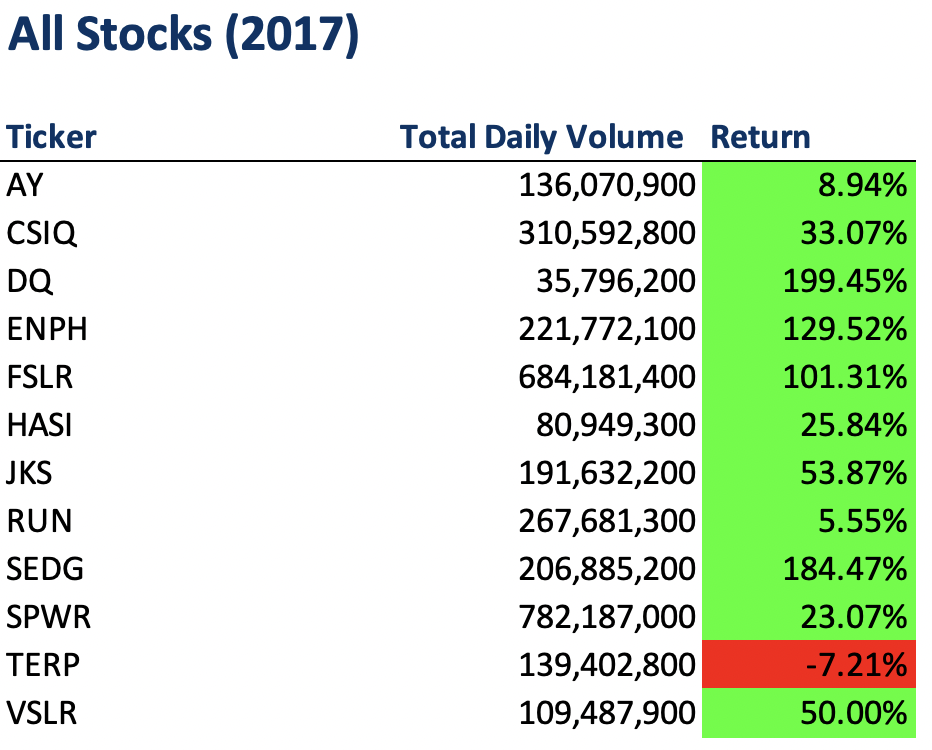
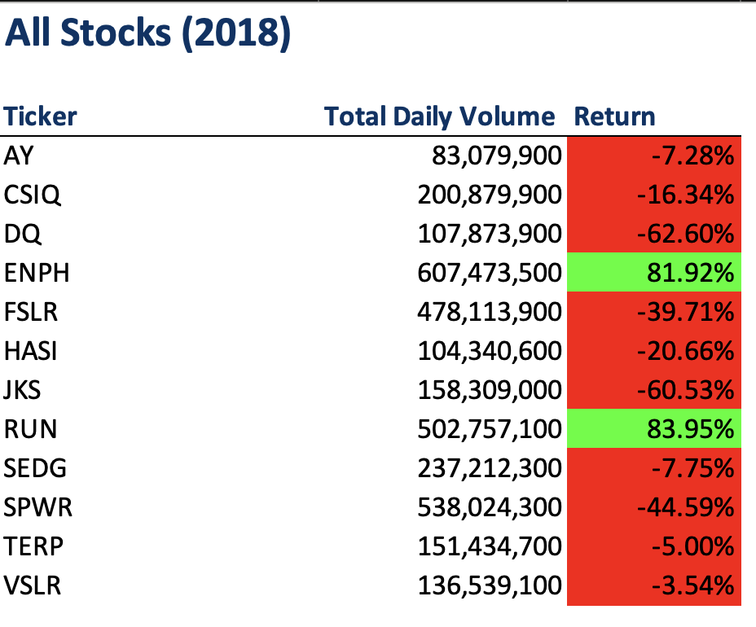

# Stock-analysis

## <u>Overview of Project</u>
The purpose of this project is to analyze stocks from green energy companies to determine which companies are good to invest in. By using VBA(Visual Basic for Applications), we will be generating workbooks that can be run faster at the click of a button.

## <u>Green Stocks Analysis</u>

First, we analyzed DAQO New Energy Corp since, but more insight was needed. Therefore, twelve more companies were compared in the analysis. 

From the analysis, almost all the stocks from 2017 did good. On the other hand, the majority reported a loss in returns in 2018. 

## <u>Results</u>
Time: 0.09375

Time: 0.1015625

## <u>Resources:</u>
[Font Color Index](https://docs.microsoft.com/en-us/office/vba/api/excel.font.colorindex)

[Range Borders](https://docs.microsoft.com/en-us/office/vba/api/excel.range.borders)

[Row Count](https://stackoverflow.com/questions/18088729/row-count-where-data-exists)

[VBA Color Index Codes](https://www.automateexcel.com/excel-formatting/color-reference-for-color-index/)